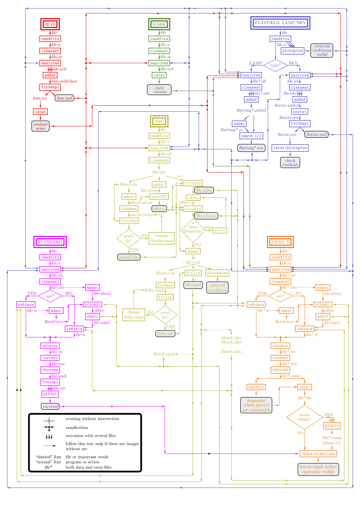

.. REDUCEME documentation master file, created by
   sphinx-quickstart on Wed Jan  4 10:54:13 2017.
   You can adapt this file completely to your liking, but it should at least
   contain the root `toctree` directive.

Welcome to REDUCEME's documentation!
====================================

REDUCEME is an astronomical data reduction package, specially devoted to the
analysis of long-slit spectroscopic data. This software was created by N.
Cardiel as part of his `thesis work
<https://hdl.handle.net/20.500.14352/108663>`_, developed under the supervision
of J.  Gorgas, at the `Departamento de Física de la Tierra y Astrofísica
<https://www.ucm.es/fisica_de_la_tierra_y_astrofisica/>`_ of the
`Universidad Complutense de Madrid <https://www.ucm.es/>`_.

Documentation outline
---------------------

.. toctree::
   :maxdepth: 2

   general_description
   license_agreement
   installation
   package_description
   classified_list
   auxiliary_libraries
