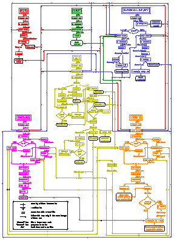

Package description
===================

Importat keywords
-----------------

Throughout this document, the following keywords will be employed very often:

* ``channel``: pixel in the wavelength direction (X axis)
* ``scan``: pixel in the spatial direction (Y axis)
* ``NCHAN``: image size in the wavelength direction
* ``NSCAN``: image size in the spatial direction
* ``STWV``: central wavelength of the first pixel of a spectrum
* ``DISP``: dispersion (Angs./pixel) in the wavelength direction

Running the programs
--------------------

REDUCEME contains individual programs to perform each desired task. In this
section we describe how to use a typical program, giving some guidelines to the
use of scripts.

Direct execution
................

This is the simplest way to run a REDUCEME program. Just type the program name
and answer the prompts. For example (assuming ``--program-prefix=R5-`` was used
when installing the program; i.e., all the programs have the prefix ``R5-``):

::

   $ R5-istat

::

   *******************************************************************************
   REDUCEMEv5.0                   Welcome to istat        Version: 7-December-1996
   -------------------------------------------------------------------------------
    
   Work with error images (y/n) [n] ? y
   Input file name? file001.u
   >>> NSCAN :    218
   >>> NCHAN :   1024
   >>> STWV  : 3740.
   >>> DISP  : 2.9000001
   >>> OBJECT: X1+56-12
   Input error file name [file001e.u] ? file001e.u
   >>> NSCAN :    218
   >>> NCHAN :   1024
   >>> STWV  : 3740.
   >>> DISP  : 2.9000001
   >>> OBJECT: X1+56-12 @ERROR@
   Valid region is: 1,218
   1st & Last Scan (0,0=EXIT) [0,0] ? 130,200
   1st & Last Scan (0,0=EXIT) [0,0] ? 0,0
   Valid region is: 1,1024
   1st & Last Channel (0,0=EXIT) [0,0] ? 1,1024
   1st & Last Channel (0,0=EXIT) [0,0] ? 0,0
   Thinking... ...OK!
    
   * Number of pixels employed/Total number: 72704/223232
   > Maximum.........................: 5725.73096     in pixel (x,y): 635,130
   > Minimum.........................: 0.             in pixel (x,y): 1,130
   > Mean............................: 941.285767
   > Sigma...........................: 440.506714
   > Median..........................: 872.831665
   > Mean (removing pixels > 3 sigma): 890.916565
    
   * Signal-to-noise ratio:
   > Mean............................: 27.616251
   > Sigma...........................: 6.31950378
   NOTE: this last statistic is uncertain (there are pixels with errors <= 0)
    
   (1) change file
   (2) change limits
   (0) STOP
   Option [0] ? 0

Using shell scripts
...................

It is also possible to use shell scripts to run any program. A simple script
file will be of the form:

::

   program_name<<string
   parameter1
   parameter2
   ..........
   ..........
   string
   
where ``program_name`` is the name of the program, ``string`` is any character
string that will be used to define the end of the parameter list, and
``parameter1``, ``parameter2``,..., are the list of program inputs.

For instance, the following script file will run the program istat in the same
way than in the above example:

::

   R5-istat<<endistat
   y
   file001.u
   file001e.u
   130,200
   0,0
   1,1024
   0,0
   0
   endistat

If the previous file is called, for example, ``istat.com`` (the name and 
extension are arbitrary), the following command:

::

   $ source istat.com
   ...

will run the program istat using the list of arguments givin in this file. The
list of arguments matchs exactly the input order, and the string endistat marks
the end of the argument list.

You can also give execute access to the script file and run it directly:

::

   $ chmod +x istat.com
   $ ./istat.com

It is also possible to pass variables to scripts from the command line. The
previous script istat.com could also be written:

::

   R5-istat<<endistat
   y
   $1
   
   130,200
   0,0
   1,1024
   0,0
   0
   endistat

In this case, by typing:

::

   $ istat.com file001.u

we will obtain the same result than before. The variable ``$1`` is replaced by
the first argument in the command line (``file001.u``).

An even more flexible script file will be:

::

   R5-istat<<endistat
   y
   $1
   
   $2
   0,0
   $3
   0,0
   0
   endistat

which can be used with variable arguments in the command line:

::

   $ istat.com file001.u 200,203 1,1024
   ...
   $ istat.com file013.u 11,80 1,1024
   ...
   $ istat.com file034.u 54,119 101,101
   ...

*However, there is an important problem related to the use of shell scripts in
the running of programs*. This is the fact that all the program inputs are
invisible to the user (they are not printed out in the screen). We have been
able to handle this problem in a subtle way. All the inputs in REDUCEME
programs can be printed out immediately (like an echo) if there is a file in
the current directory called ``.running_RUN``. You only need to create a file
with this name (no matter its content), and all the programs inputs will be
displayed during the execution of any shell script. 

In the following tables we summarized the special forms of a variable (in the C
shell), filename modifiers, comparison operators and file comparison operators,
which are very useful in the building of shell scripts

Multiple execution with R5-RUN
..............................

With the aim of simplifying the reduction process, specially when dealing with
a program (or set of programs) which is going to be used repeatedly over many
images, we have created a special shell script call ``R5-RUN`` to run any
script file with all the selected images of a fixed directory.

In order to use the script ``R5-RUN``, it is necessary to create, previously,
the script file that is going to be executed many times. For example, we could
use the file istat.com already described:

::

   R5-istat<<endistat
   y
   $1
   
   130,200
   0,0
   1,1024
   0,0
   0
   endistat

Note that in this script only one variable ``$1`` is present. If we want to
execute the program istat with the files ``file001``, ``file002``,...,
``file0??``, one possibility is to execute the script istat.com with all the
files, i.e.,

::

   $ istat.com file001
   ...
   $ istat.com file002
   ...
   ...
   ...
   $ istat.com file0??
   ...

However, it is much easier to employ the script ``R5-RUN``:

::

   % RUN istat.com
   #> Script file ./istat.com found. OK.
   #> Enter file specification.............: file0??
   #> Verify before running ([y]/n)........: n
   ...
   (script istat.com is executed over all the files file0??)
   ...
   #> End of script /usr/local/bin/R5-RUN

The first argument in the command line of ``R5-RUN`` is the name of the script
file which is going to be executed repeatedly. The file specification
determines the names of the files (wildcards are allowed) which are going to be
searched to run the script ``istat.com`` with. If we are sure that the script
``istat.com`` is working properly, we do not need to verify the process.
Otherwise, or if we are skipping some images, we must ask ``R5-RUN`` to verify
each individual execution of ``istat.com``.

::

   ...
   #> Verify before running ([y]/n)........: y
   
   Number of files found with current specifications: 14
   
   File No. 1 out of 14
   --> FILE FOUND ------------------------> ? file001
   Image size (NSCAN,NCHAN): 218,1024
   Object  : X1+56-12
   #> Run program istat.com with this file ([y]/n/x/g)? y
   #> Work in progress...
   ...

There are four possible answers to the question ``#> Run program istat.com with
this file ([y]/n/x/g)?:`` [y]es, [n]o, e[x]it (finish the execution of
``R5-RUN``) and [g]o (continue running without asking for verification).

As you probably can imagine, this is not the end of the story. The script file
``R5-RUN`` accepts more than one single argument in the command line. For
example

::

   $ R5-RUN istat.com 1,200 1,1024

has 3 arguments: ``$1=istat.com``, ``$2=1,200``, and ``$3=1,1024``. The
additional arguments following the first one are passed to the script file
istat.com in this way

::

   $ istat.com file??? 1,200 1,1024

Note that in this case, the script file ``istat.com`` must be of the form

::

   istat>>endistat
   y
   $1
   
   $2
   0,0
   $3
   0,0
   0
   endistat

In addition, ``R5-RUN`` also creates a file called ``.running_RUN`` while
running, and all the inputs that are introduced in the REDUCEME programs are
clearly visible in the standard output device.  If this script is going to be
used, it could be interesting to spend some time in its reading. This script
can be modified to introduce additional improvements to match the requirements
of more demanding users.

Handling error images
---------------------

In order to follow in detail the error propagation throughout the reduction
process, REDUCEME programs which perform arithmetical manipulations can also
translate the effect of such manipulations in associated error files. For this
purpose, an error file can be created for each data image in an early stage of
the reduction process. From that point, most of the programs will be executed
simultaneously with data and error files (if this is the user's wish). REDUCEME
programs assume that error files are named in the same way than the normal data
files, but with an additional "e" character between the portion of the file
name preceding the last period (if present) and the last period itself. If no
period is present in the file name, the character "e" is assumed to be the last
character of the complete file name. Some examples are

=================   =======================
data file name      assumed error file name
=================   =======================
file001             file001e
file398_xi.biased   file398_xie.biased
file001.new.u       file001.newe.u
=================   =======================

Anyway, it is important to note that this convention is not mandatory, and
error file names can be chosen arbitrarily (although in this last case, the
default values for the error files will not be of any use).

General reduction process
-------------------------

Here there is a short description of how to employ REDUCEME programs in a
typical reduction.

Data files involved in the reduction process
............................................

The reduction of spectroscopic data requires, apart from images of the objects
of astronomical interest, the utilization of calibration frames. Basically, we
can summarize the different types of images (commonly employed in the reduction
process) in the following list:

* BIAS: frames with no illumination (exposure time = 0 sec), to determine a 
  possible stationary, two-dimensional, additive background pattern (which is
  repeated in each CCD readout).
* DARKS: frames with no illumination but with exposure times > 0 sec, to 
  measure the background level resulting from thermally created electrons.
* FLATFIELDS: frames obtained by observing a uniform light source (typically a 
  tungsten lamp or the telescope dome). However, since the illumination of the
  slit by a lamp might no be uniform, sky frames (usually twilights or,
  preferably, although time demanding, night-sky exposures) are also needed.
  Lamp and dome flatfields are employed to correct pixel-to-pixel differential
  response, whereas twilight and night-sky flatfields are used to compensate
  for two-dimensional low-frequency scale sensitivity variations on the chip.
* ARCS: lamp spectra for wavelength calibration and correction of C-distortion.
* STANDARDS: observations of spectrophotometric standards to perform the 
  absolute/relative flux calibrarion (this type of observation is not always
  necessary, depending on the science requirements of the observations).
* OBJECTS: observations of science objects, aim of the observations.

The following scheme shows a typical reduction pipeline with REDUCEME, in which
it is easy to see how the information obtained from the calibration images is
incorporated into the reduction procedure of the OBJECT frames. The reduction
process starts in the upper left corner of the diagram (BIAS images) and ends
in the lower right corner (measurement of line-strength indices/equivalent
widths). The arrows indicate the way in which the calibration images are being
employed in the pipeline. This diagram also contains the nomenclature adopted
by the packages developpers to name the intermediate files after each
manipulation. When the file name contains a "*" character (file*), the
indicated process is performed simultaneously over data and error images.

Download a PDF version of this figure :download:`here<images/esquema_a4.pdf>`.

Reduction of BIAS frames
........................

1.- Create a log file with ``R5-fitshead`` and, if necessary, a LaTeX table with
``R5-fitstex.``

2.- Transform FITS images to REDUCEME format: ``R5-readfits``: ``file000 -->
file000.u``

3.- Remove cosmic rays: ``R5-cleanest`` or ``R5-autocos``: ``file000.u -->
file000.uc``

4.- Determine underscan and overscan regions. For this purpose, it is
convenient to use the program ``R5-plots`` with flatfield images.

5.- Subtract the BIAS value (mean, median,...) measured in the underscan and/or
overscan region(s), and extract the useful region of the images:
``basicred``: ``file000.uc --> file000.ucb``

6.- If the total number of BIAS frames obtained for each night is large, obtain
the normalized added frame (``R5-addnf``). If a two-dimensional structure is
apparent, fit it with a smooth surface by using a filter (``R5-ifilter``), a
polynomial surface (``R5-fit2dpol``) or a composite polynomial/spline surface
(``R5-fit2dspl``).

7.- Obtain the residual frame (using ``R5-imath`` if necessary), measure the
standard deviation (``R5-istat``) around the mean (that must be zero!) and
obtain the readout noise as this standard deviation times the square root of
the number of indiviual BIAS frames added.

Reduction of DARK frames
........................

1.- Create a log file with ``R5-fitshead`` and, if necessary, a LaTeX table with
``R5-fitstex.``

2.- Transform FITS images to REDUCEME format: ``R5-readfits``: ``file000 -->
file000.u``

3.- Remove cosmic rays: ``R5-cleanest`` or ``R5-autocos``: ``file000.u -->
file000.uc``

4.- Subtract the BIAS value (mean, median,...) measured in the underscan and/or
overscan region(s), the fitted two-dimensional BIAS surface, and extract the
useful region of the images: ``basicred``: ``file000.uc --> file000.ucb``

5.- If a two-dimensional structure is
apparent, fit it (for each night) with a smooth surface by using a filter (``R5-ifilter``), a
polynomial surface (``R5-fit2dpol``) or a composite polynomial/spline surface
(``R5-fit2dspl``).

6.- Determine the dark current (constant value, with ``R5-imath``, or
two-dimensional surface, with ``R5-ifilter``, ``R5-fit2dpol`` or
``R5-fit2dspl``).

Reduction of FLATFIELD frames
.............................

1.- Create a log file with ``R5-fitshead`` and, if necessary, a LaTeX table with
``R5-fitstex.``

2.- Transform FITS images to REDUCEME format: ``R5-readfits``: ``file000 -->
file000.u``

3.- Remove cosmic rays: ``R5-cleanest`` or ``R5-autocos``: ``file000.u -->
file000.uc``

4.- Subtract the BIAS value (mean, median,...) measured in the underscan and/or
overscan region(s), the fitted two-dimensional BIAS surface, the dark current
(constant or two-dimensional surface), and extract the useful region of the
images (if desired, error frames for lamp/dome flatfields can also be generated
---gain and readout noise must be known---): ``basicred``: ``file000.uc -->
file000.ucb``

5.- Average flatfields for each observing night:
``R5-addnf``: ``file000.ucb, file000e.ucb,..., file???.ucb, file???e.ucb -->
flatn?, flatn?e``

6.- Normalize the averaged lamp/dome flatfields of each night by dividing the
original frame by the averaged spectrum:

``R5-adnsc``: ``flatn?, flatn?e --> flatn?.sx, flatn?e.sx``

``R5-imath:``: ``flatn?, flatn?e, flatn?.sx, flatn?e.sx --> flatn?.nor,
flatn?e.nor``

7.- Divide twilight/sky flatfields by the normalized lamp flatfields.

8.- Twilight flatfields can be normalized using the same procedure than with
lamp flatfields. However, if C-distortion is apparent, the normalization can be
obtained using ``R5-nortwi``.

9.- Obtain a smooth two-dimensional surface by fitting the normalized twilight
flatfields with ``R5-ifilter``, ``R5-fit2dpol`` or ``R5-fit2dspl``.

*Since the slit jaws usually are not perfectly parallel, the illumination
correction that will be performed by the low frequency flatfields depends on
the slit width.*

Reduction of ARC frames
.......................

1.- Create a log file with ``R5-fitshead`` and, if necessary, a LaTeX table with
``R5-fitstex.``

2.- Transform FITS images to REDUCEME format: ``R5-readfits``: ``file000 -->
file000.u``

3.- Subtract the BIAS value (mean, median,...) measured in the underscan and/or
overscan region(s), the fitted two-dimensional BIAS surface, the dark current
(constant or two-dimensional surface), divide by the corresponding lamp
flatfield, reverse the spectra in the wavelength direction (if required), and
extract the useful region of the images (arc error frames are no generated):
``basicred``: ``file000.u --> file000.ub``

4.- Remove cosmic rays: ``R5-cleanest``: ``file000.ub --> file000.ubc``

5.- Correct C-distortion:
  * Obtain one averaged arc spectrum:
    ``R5-adnsc``: ``file000.ubc --> file000.sx``
  * Search line peaks automatically:
    ``R5-findmax``: ``file000.sx --> lincdis.dat``
  * Run ``R5-fitcdis`` and remove from the file ``lincdis.dat`` the arc lines 
    which are not well suited for the fit.
  * Obtain one averaged arc spectrum for each available arc frame:
    ``R5-adnsc``: ``file000.ubc --> lincdis.sx``
  * Determine the relative offsets between the first averaged arc spectrum 
    (from which one have obtained the file ``lincdis.dat``) and all the rest,
    with the help of the program ``R5-corrfft``. Note that the offsets measured
    with this program must be rounded to an integer and change their sign
    before introducing them in ``R5-fitcdis``.
  * Running ``R5-fitcdis`` and ``R5-cdisc``, create the polynomial for the 
    C-distortion correction: 

    ``R5-fitcdis``: ``lincdis.dat, file000.ubc --> file000.cdis1``

    ``R5-cdisc``: ``file000.ubc, file000.cdis1 --> file000.c1`` 

    ``R5-fitcdis``: ``lincdis.dat, file000.c1 --> file000.cdis2`` 

    ``R5-cdisc``: ``file000.c1, file000.cdis2 --> file000.c2`` 

    ``R5-fitcdis``: ``lincdis.dat, file000.c2 --> file000.cdis3`` 

    ``R5-cdisc``: ``file000.c2, file000.cdis3 --> file000.c3`` 

    ...

6.- After the correction of the C-distortion, all the spectra of each corrected
frame can be added: ``R5-adnsc``: ``file000.c? --> sp000.sx``

7.- Wavelength calibration: 
   * Identify all the visible lines: ``R5-findarc``: 
     ``sp000.sx --> fitlin.dat``
   * Perform the wavelength calibration: ``R5-fitlin``: 
     ``fitlin.dat, sp000.sx > pol000``

8.- Determine the spectral resolution by fitting gaussians (with ``R5-plots``)
to different, well-isolated arc lines.

Reduction of STANDARD stars
...........................

1.- Create a log file with ``R5-fitshead`` and, if necessary, a LaTeX table with
``R5-fitstex.``

2.- Transform FITS images to REDUCEME format: ``R5-readfits``: ``file000 -->
file000.u``

3.- Subtract the BIAS value (mean, median,...) measured in the underscan and/or
overscan region(s), the fitted two-dimensional BIAS surface, the dark current
(constant or two-dimensional surface), divide by the corresponding lamp/dome
and twilight/sky flatfields, reverse the spectra in the wavelength direction
(if required), and extract the useful region of the images (standard error
frames are no generated): ``basicred``: ``file000.u --> file000.ub``

4.- Remove cosmic rays: ``R5-cleanest``: ``file000.ub --> file000.ubc``

5.- Wavelength calibration, C-distortion and radial velocity correction:

``R5-rebincw``: ``file000.ubc, file000.cdis?, pol000, radial velocity -->
file000.w``

If arc frames are not available, one can use wcnoarc (note that in this case,
an intermediate sky subtraction could be required if sky lines are present):
``R5-wcnoarc``: ``file000.ubc, pol???, radial velocity --> file000.w``

6.- S-distortion correction: ``R5-sdistor``: ``file000.w --> file000.wsd``

7.- Atmospheric (and interestellar?) extinction correction:
``R5-corrext``: ``file000.wsd, airmass --> file000.wsde``

8.- Sky subtraction: ``R5-skysubm``:  ``file000.wsde --> file000.wsdek``

9.- Obtain the flux calibration curve for each standard (the tabulated flux
calibration curve must be known): ``R5-fcalspl``: ``file000.wsdek, table -->
file000.res``

10.- If there are more than one calibration curve, it is useful to create an
image with the average and all the individual flux calibration curves:
``R5-prfcal``: ``file000.res,...,file???.res --> curvresf``

Reduction of OBJECT frames
..........................

1.- Create a log file with ``R5-fitshead`` and, if necessary, a LaTeX table with
``R5-fitstex.``

2.- Transform FITS images to REDUCEME format: ``R5-readfits``: ``file000 -->
file000.u``

3.- Subtract the BIAS value (mean, median,...) measured in the underscan and/or
overscan region(s), the fitted two-dimensional BIAS surface, the dark current
(constant or two-dimensional surface), divide by the corresponding lamp/dome
and twilight/sky flatfields, reverse the spectra in the wavelength direction
(if required), and extract the useful region of the images (if desired, error
frames for objects can also be generated ---gain and readout-noise must be
known---): ``basicred``: ``file000.u --> file000.ub``

4.- Remove cosmic rays: ``R5-cleanest``: ``file000.ub --> file000.ubc``

5.- Wavelength calibration, C-distortion and radial velocity correction:

``R5-rebincw``: ``file000.ubc, file000.cdis?, pol000, radial velocity -->
file000.w``

If arc frames are not available, one can use wcnoarc (note that in this case,
an intermediate sky subtraction could be required if sky lines are present):
``R5-wcnoarc``: ``file000.ubc, pol???, radial velocity --> file000.w``

6.- S-distortion correction: ``R5-sdistor``: ``file000.w --> file000.wsd``

7.- Atmospheric (and interestellar?) extinction correction:
``R5-corrext``: ``file000.wsd, airmass --> file000.wsde``

8.- Sky subtraction: ``R5-skysubm``:  ``file000.wsde --> file000.wsdek``

9.- Extract final spectra (``R5-snratio``, ``R5-gluesc``), and measure indices
(and errors?) with ``R5-index``, ``R5-midelines``.

Image format
------------

The REDUCEME data files are stored as unformatted binary files, and they are
composed by a header, which contains basic frame information, and the data
records. Next, we give the simple FORTRAN code required to read and write files
with this format (those files can be found in the ``reduceme/specials/``
subdirectory):

* Program ``simple_read``: read a data file with REDUCEME format.
* Program ``simple_write``: write a data file with REDUCEME format.

Let's have a look to the file ``simple_read.f``:

::

          PROGRAM SIMPLE_READ
          IMPLICIT NONE
   C
          INTEGER NCHAR
          INTEGER NSCAN,NCHAN
          REAL STWV,DISP
          REAL AIRMASS,TIMEXPOS
          REAL SPECTRA(1124,1124)
          CHARACTER*12 IDENTIFICATION
          CHARACTER*255 OBJECT
          CHARACTER*255 FITSFILE
          CHARACTER*255 COMMENT
   C
   C open file
          OPEN(10,FILE='file000.dat',STATUS='OLD',FORM='UNFORMATTED')
   C read header information
          READ(10) IDENTIFICATION
          READ(10) NSCAN,NCHAN
          READ(10) STWV,DISP
          READ(10) AIRMASS
          READ(10) TIMEXPOS
          READ(10) NCHAR
          IF(NCHAR.GT.0) READ(10) OBJECT(1:NCHAR)
          READ(10) NCHAR
          IF(NCHAR.GT.0) READ(10) FITSFILE(1:NCHAR)
          READ(10) NCHAR
          IF(NCHAR.GT.0) READ(10) COMMENT(1:NCHAR)
   C read data frame
          DO I=1,NSCAN
            READ(10) (SPECTRA(J,I),J=1,NCHAN)
          END DO
          CLOSE(10)
   C end of program
          STOP
          END

The first header element, ``IDENTIFICATION``, is a character string (length=12
characters), which is employed by the programs to identify the data frames
written in REDUCEME format. Due to historical reasons, this string was chosen
to be 'abcdefghijkl'.

It is important to note that the data array ``SPECTRA`` must be dimensioned at
least to the maximum expected ``NCHAN`` and ``NSCAN``.

In order to distinguish data frames from their associated error frames, we have
decided to add the extra character string ``' @ERROR@'`` (CHARACTER*8) to the
``OBJECT`` header keyword. For example:

data file: ``file000.dat``, with ``OBJECT='NGC 9999'`` --> error file:
``file000e.dat``, with ``OBJECT='NGC 9999 @ERROR@'``

Auxiliary libraries
-------------------

REDUCEME programs have been written as single files (located in the directory
``reduceme/src``), although some commonly employed subroutines and functions
have been stored in five different libraries. A short description of these
libraries is given in this table:

``libred.a``: directory ``reduceme/red``
   * declaration of global parameters and header keywords
   * input/output of files with REDUCEME format
   * opening of graphic device(s)

``libfutils.a``: directory ``reduceme/futils``
   * input of data from keyboard
   * character string manipulation

``libfspec.a``: directory ``reduceme/fspec``
   * miscellaneous collection of functions and subroutines to perform fits, 
     sorting, find the solution of linear algebraic equations, minimize
     functions,...

``libbutton.a``: directory ``reduceme/button``
   * manipulation of graphic buttons (within user interfaces)
